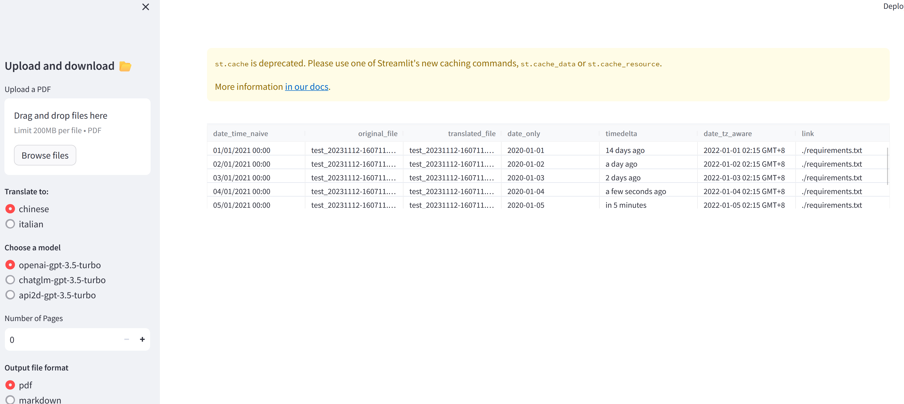
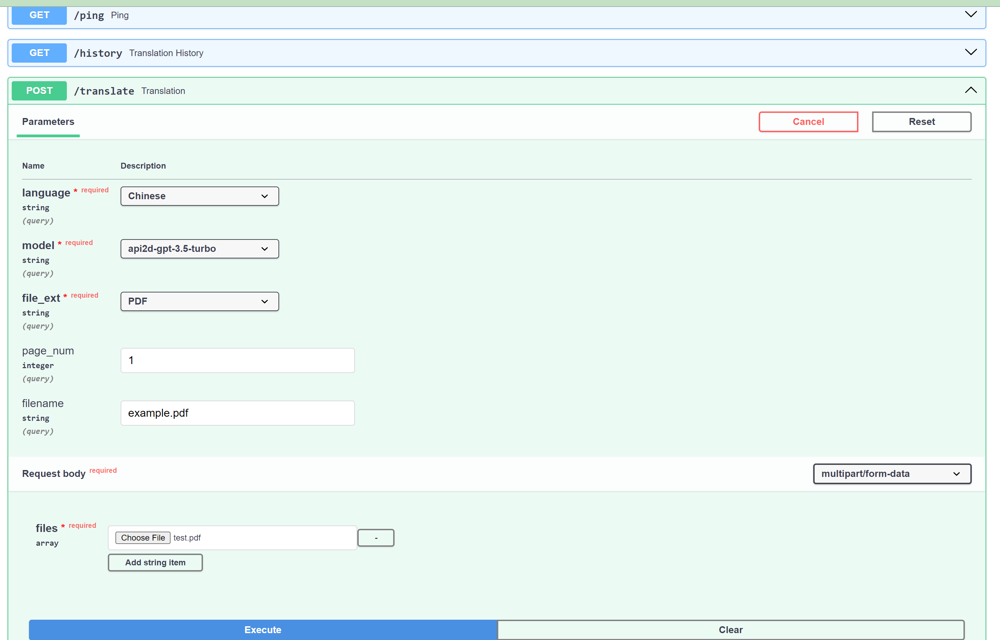
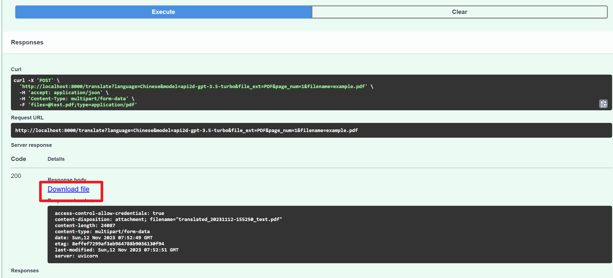

# Chatper7,17 Homework - OpenAI-Translator v2.0

## Settings
Just write a local env file which is not commited via .gitignore.  
Example file [dev.env](dev.env) here.  
Environments like `OPENAI_API_KEY` could be imported beforehand or defined in the env file.  
Langchain will pick up those reserved envs when init model.  

## Run Application
```
#start frontend
streamlit run frontend/frontend.py

#start backend
python ai_translator/server.py

#start ChatGLM server
python chatglm_server/chatglm_api.py
```

## Features
1. GUI interface
    
2. Support original layout of pdf
3. Swagger API endpoint
   
   
4. Support for other languages
5. Support other models like ChatGLM, Api2d (via model_factory.py to create langchain models)
6. Distributed and scalable backend via `Ray.io`

## ChatGlM Deployment
1. Install git lfs
2. Download model from [modelscope](https://modelscope.cn/models/ZhipuAI/chatglm3-6b/summary)
3. Specify model path by replacing model name with path in `from_pretrained("THUDM/chatglm3-6b",` statements.
4. Run `python chatglm_server\chatglm_api.py`. The endpoint url is `http://localhost:8000/v1/`
5. Test run `tests\tests_chatglm.py`